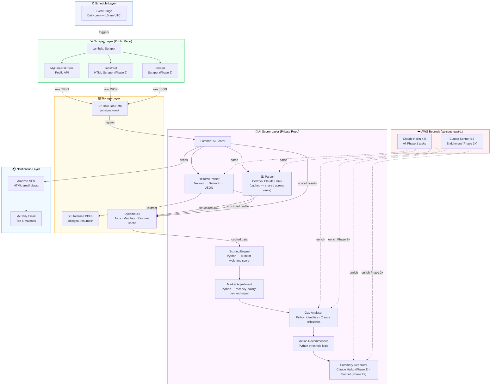

# Job Signal Core

> AI-powered job screening pipeline that automatically scores job postings against your resume using AWS Bedrock + Claude — and delivers only your top matches daily.

---

## The Problem

Platform job alerts match on job title keywords only — not on actual job description vs your resume. Manually screening 20+ daily alerts across LinkedIn, MCF, and Jobstreet was taking 30+ minutes. I automated the entire loop.

---

## Architecture



**Data flow:** EventBridge fires once daily → Scraper Lambda pulls listings from MCF (Jobstreet/Indeed in Phase 2) → raw JSON lands in S3 → S3 event triggers the AI scorer → Claude Haiku parses each JD (result cached in DynamoDB, shared across users) → salary pre-filter short-circuits ineligible jobs → 8-factor Python scoring engine runs → Claude Haiku writes the gap analysis and summary (Phase 1; Sonnet in Phase 2+) → top 5 matches delivered as an HTML email digest by the scorer Lambda.

---

## Tech Stack

| Layer | Technology |
|---|---|
| Compute | AWS Lambda (serverless) |
| Scheduling | Amazon EventBridge (daily cron) |
| Storage | Amazon S3 + DynamoDB |
| AI / LLM | AWS Bedrock — Claude Haiku 4.5 (all Phase 1 tasks) · Sonnet 4.6 (enrichment, Phase 2+) |
| Notifications | Amazon SES |
| Infrastructure as Code | AWS CDK (Python) |
| CI/CD | GitHub Actions + OIDC (no static credentials) |
| Language | Python 3.12 |

---

## Scoring Model

Each job listing is scored across **eight weighted factors**:

- Technical Skills Match
- Seniority Alignment
- Work Arrangement
- Citizenship Eligibility
+ 4 additional proprietary factors


A gap analyser identifies missing requirements; Claude articulates them as concrete action items in the email digest.

---

## Cost-Aware Design

The key architectural decision is **JD parser result caching** in DynamoDB.

Every job listing requires a Bedrock call to extract structured data. At scale, many users score against the same daily listings. Without caching, 1,000 users × 50 daily jobs = **50,000 Bedrock calls/day**. The parsed JSON output of each JD is stored in DynamoDB (`jobsignal-jd-cache`, 60-day TTL) keyed by `job_id`. On a cache hit, Bedrock is not called at all — reducing that to **50 calls/day**, a 1,000× reduction.

The resume parser is also cached (invalidated only on resume upload), so repeat daily runs for the same user incur zero Textract or Bedrock calls for resume parsing.

| Scale | Monthly Bedrock Cost | Notes |
|---|---|---|
| 1 user (personal) | ~$1.50 | Haiku for all tasks |
| 1,000 users (SaaS) | ~$211 | Haiku for parsing, Sonnet for writing — JD cache shared |

At 1,000 users on a SGD 15/month Pro plan, infrastructure is **1.4% of revenue**.

---

## Phase Roadmap

### Phase 1 — Single-User Pipeline ✅
- EventBridge → Lambda orchestrator (simple, no state machine overhead)
- MCF public API scraper with strategy pattern (`BaseScraper` ABC)
- DynamoDB deduplication (job listings are idempotent across daily runs)
- CDK-managed infrastructure, GitHub Actions CI/CD with OIDC

### Phase 2 — Multi-Tenant + Reliability 🔧 *(in progress)*
- **AWS Step Functions (Standard Workflow)** replaces direct Lambda chaining — needed for per-user parallel scoring, long-polling Textract, and observable retry logic
- Multi-tenant row-level DynamoDB isolation
- SQS fan-out for parallel per-user scoring
- Resume upload + re-parsing (MD5 hash check — only reparse on change)
- Additional scrapers: Jobstreet, Indeed (via `BaseScraper` strategy pattern)

### Phase 3 — Cost Optimisation *(planned)*
- Llama 4 via Bedrock for parsing tasks (replace Haiku at scale)
- Evaluate SageMaker self-hosting for >1,000 concurrent users

---

## Running It

```bash
pip install -r requirements.txt
pip install -r requirements-dev.txt
pytest tests/unit/
cdk deploy JobSignalScraperStack
```

Lambda environment variables (`JOBS_BUCKET`, `JOBS_TABLE`, `AWS_REGION`) are injected by CDK — no credentials in code. CI/CD runs via GitHub Actions + OIDC; no static AWS credentials stored in GitHub Secrets.

---

## Go Deeper

The architecture document covers the full system design: Open Core repo strategy, AI scoring pipeline internals, cost analysis, and the Phase 1 → Phase 2 orchestration transition (EventBridge/Lambda → Step Functions).

→ [System Architecture](docs/ARCHITECTURE.md) · [Design Decisions](docs/design/design-decisions.md) · [Cost Profile](docs/design/cost-profile.md) · [AI Scoring Pipeline](docs/design/ai-scoring-pipeline.md)
