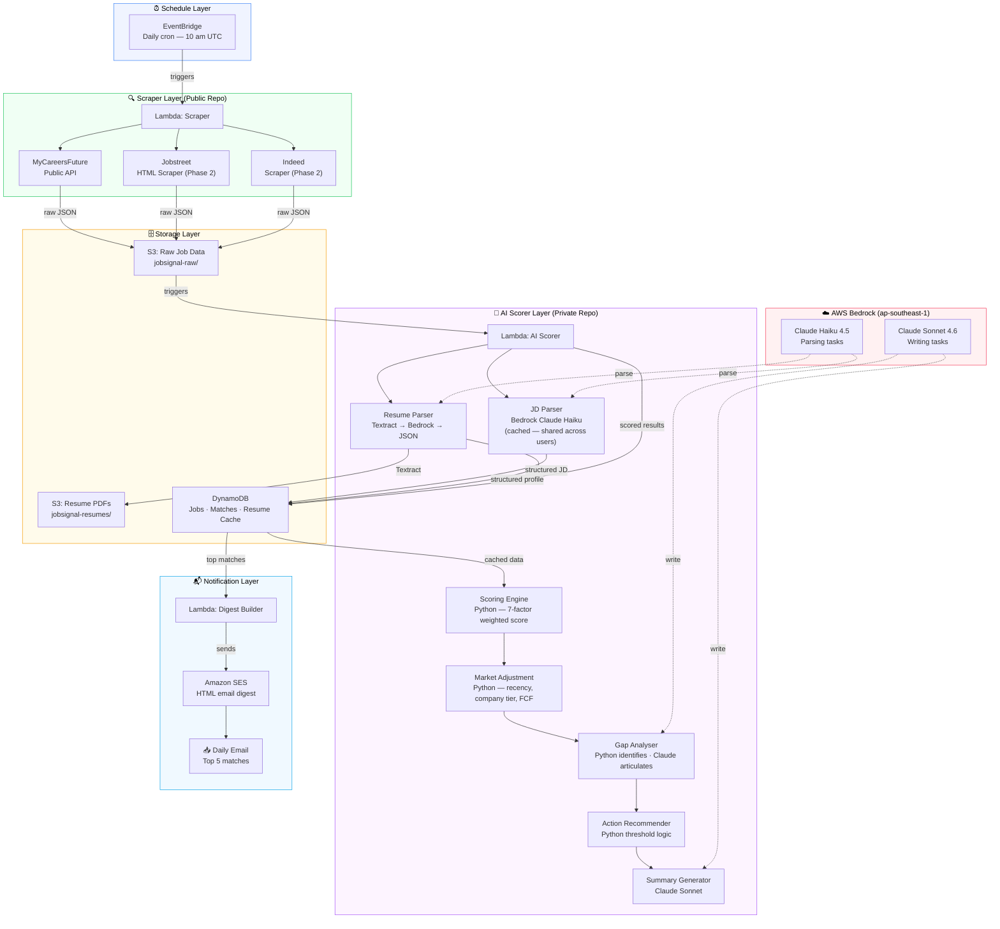

# JobSignal — System Architecture

> AI-powered job screener that scrapes job platforms daily, scores each listing against your resume with AI, and delivers the top matches to your inbox.

---

## The Problem

Platform job alerts match on job title keywords only — not on the actual job description vs your resume. You waste 30–60 minutes per day reading irrelevant listings, miss well-matched roles with non-standard titles, and have no single tool aggregating multiple platforms.

## The Solution

JobSignal scrapes job platforms daily, uses AI to screen each listing against a structured resume profile, scores every role across seven weighted factors, and delivers only the top matches — with a fit score, plain-English summary, and actionable gap analysis.

---

## Tech Stack

| Layer | Technology |
|---|---|
| Compute | AWS Lambda (serverless) |
| Scheduling | Amazon EventBridge (daily cron) |
| Storage | Amazon S3 + DynamoDB |
| AI / LLM | AWS Bedrock — Claude Haiku 4.5 + Sonnet 4.6 |
| Notifications | Amazon SES (email digest) |
| Infrastructure as Code | AWS CDK (Python) |
| CI/CD | GitHub Actions + OIDC (no static credentials) |
| Language | Python 3.12 |

---

## Architecture



### How It Works

1. **EventBridge** fires a cron at 10 am UTC every day
2. **Scraper Lambda** calls the MyCareersFuture public API, extracts job listings, deduplicates against DynamoDB, and stores raw JSON to S3
3. **AI Scorer Lambda** picks up new jobs from S3, parses each job description via Bedrock (result cached — called once per unique JD across all users), and runs every listing through the 7-factor Python scoring engine
4. Market adjustments (recency, company tier, FCF listing status) are applied by Python
5. For jobs scoring ≥ 5.0, Bedrock articulates gap analysis and generates a human-readable match summary
6. Results are written to DynamoDB with a TTL of 90 days
7. **Digest Lambda** queries the top 5 matches and sends a formatted HTML email via SES

---

## Repository Strategy

This project uses an **Open Core model**:

| Repository | Visibility | Contents | Licence |
|---|---|---|---|
| `job-signal-core` (this repo) | Public | Scrapers, CDK infrastructure, CLI | AGPL v3 |
| `job-signal-saas` | Private | AI scorer, SaaS API, billing, dashboard | Proprietary |

The AGPL v3 licence permits free self-hosting and forks, but requires anyone running a hosted service to open-source their modifications. This is the same strategy used by Grafana, GitLab, and MongoDB — providing open portfolio visibility while protecting commercial IP.

### What Lives Where

```
Public repo (job-signal-core)         Private repo (job-signal-saas)
─────────────────────────────         ──────────────────────────────
MyCareersFuture scraper               AI scoring engine (7 factors)
Jobstreet scraper                     Prompt templates
CDK infrastructure stacks             SaaS API (API Gateway + Lambda)
Lambda handler entry points           Multi-tenant DynamoDB design
CI/CD GitHub Actions workflows        Cognito user management
Unit + integration tests              Stripe billing integration
This architecture document            React dashboard
```

---

## Deep Dives

Detailed design documentation for each building block:

| Topic | Document |
|---|---|
| AWS service choices and justifications | [AWS Services](design/aws-services.md) |
| AI scoring pipeline, caching, and thresholds | [AI Scoring Pipeline](design/ai-scoring-pipeline.md) |
| S3 layout, DynamoDB schema, LLM provider decision | [Data Flow](design/data-flow.md) |
| Cost profile — personal use and SaaS at scale | [Cost Profile](design/cost-profile.md) |
| Key design decisions (CDK, EventBridge, OIDC, model strategy) | [Design Decisions](design/design-decisions.md) |

---
