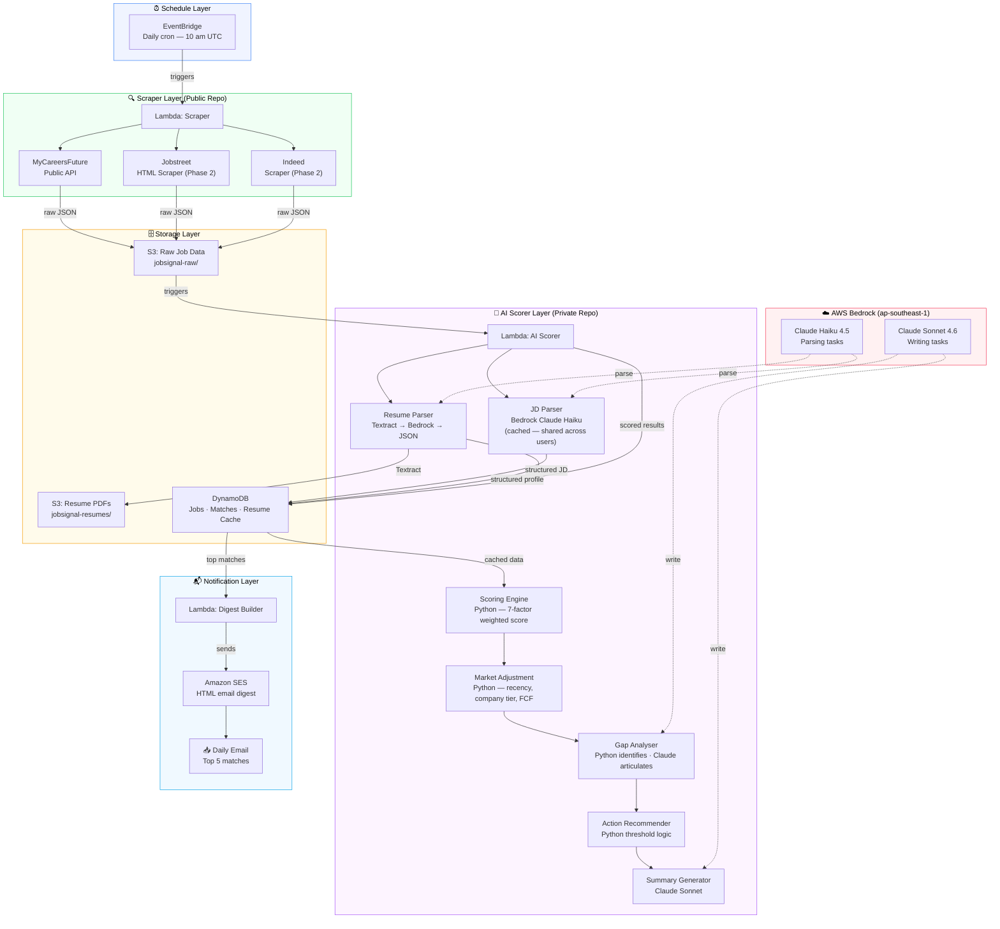
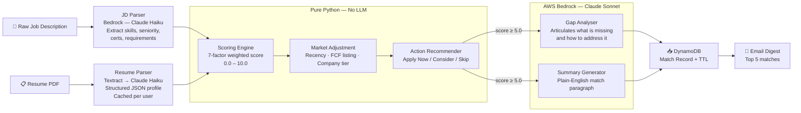

# JobSignal — System Architecture

> AI-powered job screener for the job market. Built on AWS serverless infrastructure with a hybrid Python + LLM scoring pipeline.

---

## Table of Contents

1. [Project Overview](#1-project-overview)
2. [System Architecture](#2-system-architecture)
3. [AWS Services](#3-aws-services)
4. [AI Scoring Pipeline](#4-ai-scoring-pipeline)
5. [Data Flow](#5-data-flow)
6. [Repository Strategy](#6-repository-strategy)
7. [Cost Profile](#7-cost-profile)
8. [Design Decisions](#8-design-decisions)

---

## 1. Project Overview

### The Problem

Platform job alerts (LinkedIn, MyCareersFuture, Jobstreet) match on job title keywords only — not on the actual job description vs your resume. The result:

- 30–60 minutes per day reading irrelevant listings
- Missing well-matched roles with non-standard titles
- No explanation of why a role does or does not fit your profile
- No single tool aggregating multiple job platforms

### The Solution

JobSignal scrapes job platforms daily, uses AI to screen each listing against a structured resume profile, scores every role across seven weighted factors, and delivers only the top matches to your inbox — with a fit score, plain-English summary, and actionable gap analysis.

### Tech Stack at a Glance

| Layer | Technology |
|---|---|
| Compute | AWS Lambda (serverless) |
| Scheduling | Amazon EventBridge (daily cron) |
| Storage | Amazon S3 + DynamoDB |
| AI / LLM | AWS Bedrock — Claude Haiku 4.5 + Sonnet 4.6 |
| Notifications | Amazon SES (email digest) |
| Infrastructure as Code | AWS CDK (Python) |
| CI/CD | GitHub Actions + OIDC (no static credentials) |
| Language | Python 3.12 |

---

## 2. System Architecture

### 2.1 High-Level Architecture Diagram
Phase 1 - Single User | A working system that scrapes MyCareersFuture daily, screens listings against your resume, and emails you the top matches.


### 2.2 End-to-End Flow (Plain English)

1. **EventBridge** fires a cron at 10 am UTC every day
2. **Scraper Lambda** calls the MyCareersFuture public API, extracts job listings, deduplicates against DynamoDB, and stores raw JSON to S3
3. **AI Scorer Lambda** picks up new jobs from S3, parses each job description via Bedrock (result cached — called once per unique JD across all users), and runs every listing through the 7-factor Python scoring engine
4. Market adjustments (recency, company tier, FCF listing status) are applied by Python
5. For jobs scoring ≥ 5.0, Bedrock articulates gap analysis and generates a human-readable match summary
6. Results are written to DynamoDB with a TTL of 90 days
7. **Digest Lambda** queries the top 5 matches and sends a formatted HTML email via SES

---

## 3. AWS Services

| Service | Role | Cost (personal use) |
|---|---|---|
| **Lambda** | Serverless compute — scraper, scorer, digest | Free tier |
| **EventBridge** | Daily cron trigger (10 am UTC) | Free |
| **S3** | Raw job JSON + resume PDF storage | ~$0.01/month |
| **DynamoDB** | Job dedup, match results, resume + JD cache | Free tier |
| **SES** | Daily HTML email digest | Free tier |
| **Bedrock** | LLM gateway — Claude Haiku + Sonnet in `ap-southeast-1` | ~$1.50/month |
| **Textract** | Resume PDF text extraction (one-time per upload) | Pay-per-page |
| **Secrets Manager** | Third-party API key storage | ~$0.80/month |
| **CloudWatch** | Structured logging, alarms, dashboards | Free tier |
| **CDK** | Infrastructure as Code — all AWS resources defined in Python | Free |
| **API Gateway** | REST API for SaaS layer (Phase 2+) | Free: 1M calls/month |
| **Cognito** | User authentication (Phase 2+) | Free: 50K MAU |

### Why Lambda over ECS / EC2?

The scraper and scorer run for ≤ 2 minutes daily. Lambda costs effectively $0.00 at personal-use scale and eliminates all container management overhead. ECS would add ~$15/month in idle container costs with no benefit at this workload size.

### Why DynamoDB over RDS?

Job listings and match records are accessed by primary key (`job_id`, `user_id`) and never require multi-table joins. DynamoDB's free tier handles 25 GB storage and 200M requests/month — RDS equivalent starts at ~$15/month and requires patch management.

---

## 4. AI Scoring Pipeline

The scoring pipeline deliberately separates **deterministic business logic (Python)** from **language understanding tasks (Bedrock)**. This is a conscious architectural decision, not a cost optimisation.



### 4.1 Scoring Factors

The scoring engine evaluates seven weighted factors. Specific weights and sub-criteria are proprietary and defined in the private `job-signal-saas` repository.

| Factor |
|---|
| Technical Skills Match |
| Seniority Alignment |
| Work Arrangement |
| Citizenship Eligibility |
| + 3 additional proprietary factors |

### 4.2 Why Python Handles Scoring (Not the LLM)

| Property | Python Engine | Claude API |
|---|---|---|
| Consistency | Same inputs → same score, always | Non-deterministic |
| Explainability | Exact factor breakdown available | Black box |
| Cost | Zero marginal cost | $0.002–0.015 per call |
| Latency | Sub-millisecond | 1–3 seconds |
| Auditability | Unit-testable, version-controlled weights | Prompt-dependent |

Claude is used only where language understanding cannot be replaced by deterministic logic: parsing unstructured text and generating human-readable prose.

### 4.3 JD Parsing Cache Design

```
Without caching:  1,000 users × 50 JDs/day = 50,000 Bedrock calls/day
With caching:     50 new JDs/day = 50 Bedrock calls/day   (1,000× cheaper)
```

Each unique job description is parsed once. The structured result is cached in DynamoDB and reused for every user who is scored against that job.

### 4.4 Action Recommendation Thresholds

| Score Range | Recommendation |
|---|---|
| ≥ 8.0, no blocking gaps | 🟢 **Apply Now** — Strong Match |
| ≥ 6.5, ≤ 1 blocking gap | 🟡 **Apply with Note** — Address gap in cover letter |
| ≥ 5.0 | 🟠 **Consider** — Several gaps, lower probability |
| < 5.0 or hard disqualifier | 🔴 **Skip** — Poor match |

---

## 5. Data Flow

### 5.1 S3 Object Layout

```
jobsignal-raw/
└── mcf/
    └── 2026-04-10/
        └── jobs_batch_01.json

jobsignal-resumes/
└── {user_id}/
    └── resume_v3.pdf
```

### 5.2 DynamoDB Table Design

| Table | Partition Key | Sort Key | TTL | Purpose |
|---|---|---|---|---|
| `jobs` | `job_id` | — | 60 days | Raw job metadata + dedup |
| `matches` | `USER#{user_id}` | `JOB#{job_id}` | 90 days | Scored results per user |
| `resume_cache` | `USER#{user_id}` | — | None | Structured resume profile |
| `jd_cache` | `job_id` | — | 60 days | Parsed JD — shared across users |

All TTL values are set at write time. DynamoDB handles expiry automatically — no maintenance Lambda required.

### 5.3 LLM Provider Decision

AWS Bedrock was chosen over direct Anthropic / OpenAI API calls for four reasons:

1. **Data residency** — All inference runs within a single configured AWS region. Resume data never leaves that regional infrastructure.
2. **IAM authentication** — Lambda assumes a role directly; no API keys to store or rotate.
3. **Model portability** — Swapping Claude for Llama 4 requires one line change in the model map, not an architecture change.
4. **Portfolio signal** — AWS-native design is what Cloud Architect and Solutions Architect roles expect to see.

> DeepSeek was evaluated and rejected immediately — it processes data on China-based infrastructure, which is incompatible with handling personal resume data in Singapore.

---

## 6. Repository Strategy

This project uses an **Open Core model**:

| Repository | Visibility | Contents | Licence |
|---|---|---|---|
| `job-signal-core` (this repo) | Public | Scrapers, CDK infrastructure, CLI | AGPL v3 |
| `job-signal-saas` | Private | AI scorer, SaaS API, billing, dashboard | Proprietary |

The AGPL v3 licence permits free self-hosting and forks, but requires anyone running a hosted service to open-source their modifications. This is the same strategy used by Grafana, GitLab, and MongoDB — providing open portfolio visibility while protecting commercial IP.

### What Lives Where

```
Public repo (job-signal-core)         Private repo (job-signal-saas)
─────────────────────────────         ──────────────────────────────
MyCareersFuture scraper               AI scoring engine (7 factors)
Jobstreet scraper                     Prompt templates
CDK infrastructure stacks             SaaS API (API Gateway + Lambda)
Lambda handler entry points           Multi-tenant DynamoDB design
CI/CD GitHub Actions workflows        Cognito user management
Unit + integration tests              Stripe billing integration
This architecture document            React dashboard
```

---

## 7. Cost Profile

### 7.1 Personal Use (~1 User)

| Service | Monthly Cost |
|---|---|
| Lambda (all functions) | $0.00 |
| EventBridge | $0.00 |
| DynamoDB | $0.00 |
| S3 | ~$0.01 |
| SES | $0.00 |
| Bedrock (Claude Haiku) | ~$1.50 |
| Secrets Manager | ~$0.80 |
| **Total** | **~$2.31/month** |

### 7.2 SaaS at 1,000 Users

| Service | Monthly Cost | Notes |
|---|---|---|
| Bedrock (Haiku + Sonnet) | ~$211 | JD parsing shared via cache |
| DynamoDB | ~$5 | On-demand pricing |
| Lambda | ~$2 | Beyond free tier |
| SES | ~$3 | ~30K emails/month |
| **Total** | **~$221/month** | At SGD 15/user Pro plan = SGD 15K MRR = **1.4% of revenue** |

The JD parsing cache is the key cost lever. Without it, 1,000 users scoring against the same 50 daily jobs would generate 50,000 Bedrock calls/day instead of 50.

---

## 8. Design Decisions

### CDK over Terraform

AWS CDK (Python) was chosen for this project because all infrastructure logic is already in Python — the same language as the application code. This allows shared types, constants, and test utilities between application code and infrastructure definitions. Terraform would require a context switch to HCL and a separate state management setup.

### EventBridge over SQS Fan-Out (Phase 1)

For a single-user daily scrape, EventBridge→Lambda is the simplest correct solution. The architecture is designed to migrate to SQS fan-out with Step Functions orchestration in Phase 2 when parallel per-user scoring becomes necessary. This is documented in ADR-011.

### GitHub Actions with OIDC Authentication

All CI/CD workflows use AWS OIDC federation. No long-lived AWS credentials are stored in GitHub Secrets. The deploy workflow assumes a scoped IAM role via `aws-actions/configure-aws-credentials` with a short-lived token.

### Phased Model Strategy

| Phase | Users | Models | Cost |
|---|---|---|---|
| Phase 1 | 0–100 | Claude Haiku 4.5 for all tasks | ~$1.50/month |
| Phase 2 | 100–1,000 | Haiku for parsing, Sonnet for writing | ~$211/month per 1K users |
| Phase 3 | 1,000+ | Llama 4 via Bedrock for parsing, Sonnet for writing | Evaluate SageMaker self-host |

---

*Built by [uidn8804] — April 2026*
