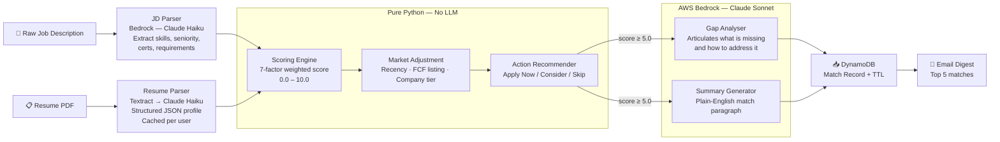

# AI Scoring Pipeline

> Back to [Architecture Overview](../ARCHITECTURE.md)

---

## Overview

The scoring pipeline deliberately separates **deterministic business logic (Python)** from **language understanding tasks (Bedrock)**. This is a conscious architectural decision, not a cost optimisation.

---

## Pipeline Diagram



---

## Scoring Factors

The scoring engine evaluates seven weighted factors. Specific weights and sub-criteria are proprietary and defined in the private `job-signal-saas` repository.

| Factor |
|---|
| Technical Skills Match |
| Seniority Alignment |
| Work Arrangement |
| Citizenship Eligibility |
| + 3 additional proprietary factors |

---

## Why Python Handles Scoring (Not the LLM)

| Property | Python Engine | Claude API |
|---|---|---|
| Consistency | Same inputs → same score, always | Non-deterministic |
| Explainability | Exact factor breakdown available | Black box |
| Cost | Zero marginal cost | $0.002–0.015 per call |
| Latency | Sub-millisecond | 1–3 seconds |
| Auditability | Unit-testable, version-controlled weights | Prompt-dependent |

Claude is used only where language understanding cannot be replaced by deterministic logic: parsing unstructured text and generating human-readable prose.

---

## JD Parsing Cache Design

```
Without caching:  1,000 users × 50 JDs/day = 50,000 Bedrock calls/day
With caching:     50 new JDs/day = 50 Bedrock calls/day   (1,000× cheaper)
```

Each unique job description is parsed once. The structured result is cached in DynamoDB and reused for every user who is scored against that job.

---

## Action Recommendation Thresholds

| Score Range | Recommendation |
|---|---|
| ≥ 8.0, no blocking gaps | 🟢 **Apply Now** — Strong Match |
| ≥ 6.5, ≤ 1 blocking gap | 🟡 **Apply with Note** — Address gap in cover letter |
| ≥ 5.0 | 🟠 **Consider** — Several gaps, lower probability |
| < 5.0 or hard disqualifier | 🔴 **Skip** — Poor match |
